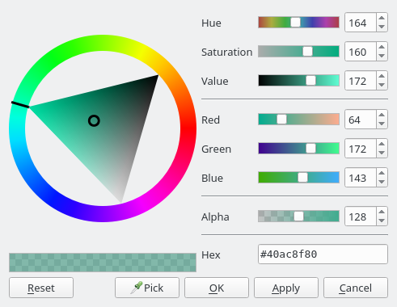
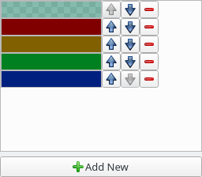
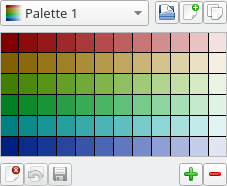
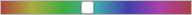

Color Widgets
=============

Color2DSlider
-------------

This widget allow the user to select 2 HSV color components at the same time,
by default that is Saturation and Value but they can be changed.

ColorDialog
-----------

This is a dialog analogous to QColorDialog but with a much nicer and friendlier 
user interface. It uses several of the other widgets.

ColorLineEdit
-------------

This is a QLineEdit intended to be used to edit and display color names.
It accepts several string formats:
* #f00 (3 hexadecimal rgb digits)
* #ff0000 (6 hexadecimal rgb digits)
* rgb(255,0,0) (function-like)
* red (color name)

It can optionally display the color it represents on its background.

ColorListWidget
---------------

It allows to display and edit a list of colors.

ColorPaletteWidget and Swatch
-----------------------------
These widgets handle color palettes.

Swatch only handles a single palette, can be used to just select colors from the 
palette or to modify the palette via drag and drop operations.

ColorPaletteModel is a list model that represents palettes with can be used
with the Qt item view widgets, it provides a name and a preview icon for
each of the stored palettes.
It also has functionality to load and save palettes from the filesystem.

ColorPaletteWidget manages a list of palettes (via ColorPaletteModel).
Has two modes: read-only only allows to select palettes and colors,
otherwise it can be used to modify the list of palettes and the palette itself.

ColorPreview and ColorSelector
------------------------------

ColorPreview is a widget that displays a color or compares two colors.

ColorSelector is like ColorPreview but when clicked it shows a ColorDialog.

GradientSlider and HueSlider
----------------------------

GradientSlider is a QSlider which uses a gradient as its background.

HueSlider is specifically made to select a hue and has more information
about the represented color.
